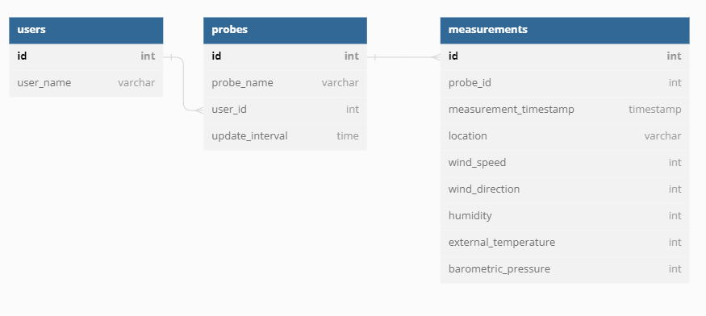

# SAM Instrument

Smart Atmospheric Meteorological Instrument

## Harmonogram

1. Przydzielenie projektu
2. Założenia projektu
3. Skład komponentów
4. Koncepcyjne przedstawienie działania
5. Implementacja modułu I
6. Implementacja modułu II
7. Implementacja modułu III
8. Implementacja zasilania
9. Implementacja komunikacji
10. Struktura
11. Złożenie, testy
12. Ostateczny termin
13. Termin awaryjny

---

## Database diagram



## Program Code
```c
#include <Arduino.h>
#include <WiFiMulti.h>
#include <HTTPClient.h>
#include <WiFiClientSecure.h>
#include <WebServer.h>
#include <ArduinoJson.h>

WebServer server(80);
WiFiMulti WiFiMulti;
String serverName = "https://czujnikwiatru.pythonanywhere.com/api/measurements";

void setupWifi()
{
  WiFi.mode(WIFI_STA);
  const char* ssid = "";  // Enter SSID here
  const char* password = "";  //Enter Password here
  WiFiMulti.addAP(ssid, password);

  // wait for WiFi connection
  Serial.print("Waiting for WiFi to connect...");
  while ((WiFiMulti.run() != WL_CONNECTED))
  {
    Serial.print(".");
  }
  Serial.println("WiFi connected..!");
}

int generateData()
{
  return random(0, 1024);
}

void postToServer()
{
  if (WiFiMulti.run() == WL_CONNECTED)
  {    
    HTTPClient http;   
    http.begin("https://czujnikwiatru.pythonanywhere.com/api/measurements");  
    http.addHeader("Content-Type", "application/json");         
     
    StaticJsonDocument<500> doc;
  
    doc["barometric_pressure"] = generateData();
    doc["cloudiness"] =  generateData();
    doc["external_temperature"] = generateData();
    doc["location"] = NULL;
    doc["measurement_timestamp"] = NULL;
    doc["probe_id"] = 1;
    doc["wind_direction"] = generateData();
    doc["wind_speed"] = generateData();
      
    String requestBody;
    serializeJson(doc, requestBody);
    Serial.println(requestBody);
    int httpResponseCode = http.POST(requestBody);
    delay(100);
    String response = http.getString();                       
    Serial.println(httpResponseCode);   
    Serial.println(response);
  }
}

void setup()
{
  Serial.begin(115200);
  setupWifi();
  randomSeed(analogRead(0));
}

void loop()
{
  delay(5000);
  postToServer();
}
```

## Schematic


Resistors used are 10kOhm.
### Connections:
* BMP280:
  * VIN -> 3V3 BUS
  * GND -> GND BUS
  * SCK -> ESP32: D22
  * SDI -> ESP32: D21
* HMC5883L:
  * VCC -> 3V3 BUS
  * GND -> GND BUS
  * SCK -> ESP32: D22
  * SDI -> ESP32: D21
* IR Break Beam Sensor:
  * VCC -> 3V3 BUS (both)
  * GND -> GND BUS (both)
  * SIG -> GPIO16 [^1]
* Photocell:
  * One leg connected to GPIO4  [^1]
* Thermistor:
  * One leg connected to GPIO26  [^1]

 [^1]: You can choose any GPIO port available
