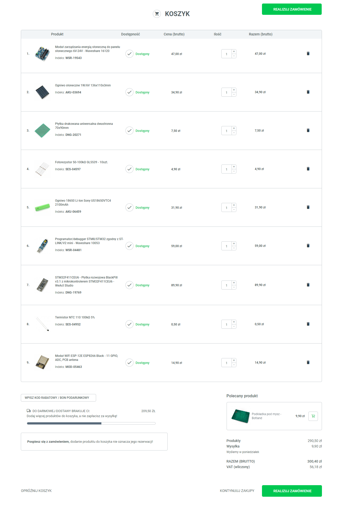

## Shopping list

- STM32 + programmer or STM32 NUCLEO (programmer included)
- WiFi module
- photovoltaic module 6V - 24V
- solar energy management module for 6V - 24V solar panel
- rechargable batteries
- Double-sided universal PCB (approx. dimensions 80mm - 150mm)
- electronic components
  - photoresistor 10kOhm - 100kOhm
  - NTC Thermistors (a few pieces)
    - 100kOhm
    - 10kOhm
  - Resistors (a few pieces)
    - 100kOhm
    - 10kOhm
  - Capacitors
  - Transistors (MOSFET)
- sealed ball bearing[^1]
- shaft[^1]
  [^1]:Shaft diameter has to match the bearings' inner diameter (max value of 8mm).

